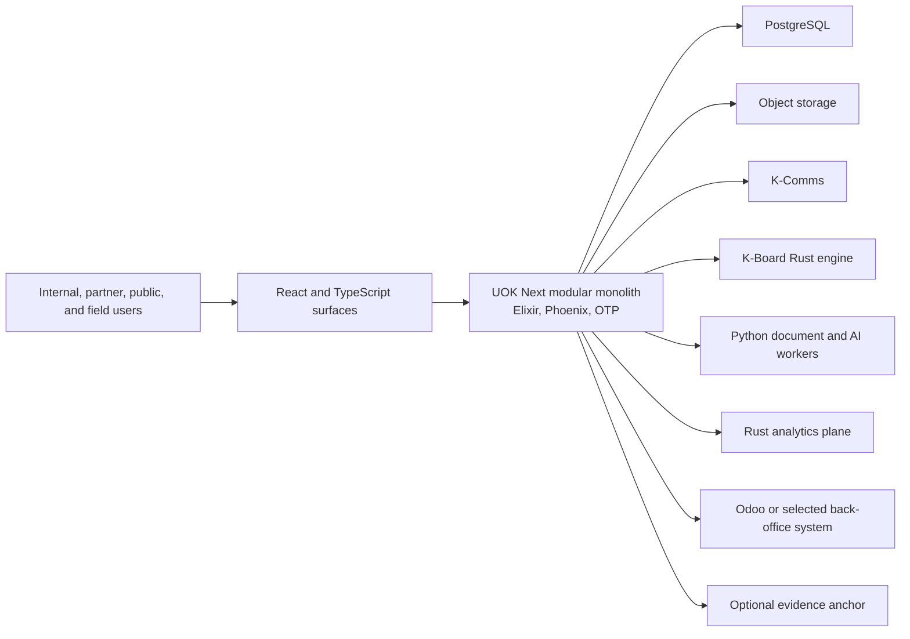

# UOK Next Architecture

**Status:** Accepted target architecture; Gate 1 implementation scaffolded

## 1. Architecture objective

UOK Next is a product-neutral operating kernel with installable business
modules and deliberately isolated specialist runtimes. It starts as a modular
monolith because the early business domains share transactions, identity,
policy, audit, deployment cadence, and a small engineering organization.

Service extraction requires evidence of independent scaling, security,
availability, data residency, vendor, or runtime pressure and a new ADR.

## 2. System context

## 3. Runtime containers

### UOK web/application release

Owns HTTP APIs, authenticated sessions, policy enforcement, transactional
commands, module composition, read models, human tasks, evidence metadata,
outbox publication, and the initial operational UI delivery boundary.

The React/TypeScript workspace compiles content-hashed assets into this same
release. `web/src/shell` is presentation-only and module-neutral; future module
UI belongs under `web/src/modules/<module-id>`. Browser code may request
server-owned commands and queries but never becomes authoritative for tenant,
authorization, approval, audit, evidence, or business transitions. The delivery
toolchain and deferrals are governed by ADR-0008.

### PostgreSQL

The transactional system of record for kernel and in-process business modules.
Every table is owned by one module. Cross-module reads use public query
contracts or projections; cross-module writes use commands. PostgreSQL 19 is
the governed target. Cluster identity, roles, connections, migrations, tenant
integrity, HA/fencing, WAL/PITR, observability, maintenance, capacity, upgrade,
and retirement requirements are defined in
[`DATABASE_ARCHITECTURE.md`](DATABASE_ARCHITECTURE.md) and ADR-0007.

### Object storage

Stores business documents and evidence objects. PostgreSQL stores metadata,
hashes, policy, retention, review state, and object references. Upload,
download, promotion, redaction, quarantine, and deletion are explicit audited
commands.

### Durable work layer

PostgreSQL-backed outbox and jobs provide retries, schedules, external side
effects, integration receipts, and dead-letter review. Business transactions
never rely on an uncommitted in-memory message.

### Specialist runtimes

- K-Comms owns messages, conversation membership, attachments, calls,
  presence, notifications, retention, and communication audit.
- K-Board owns canvas operations, convergence, snapshots, and offline merge.
- Python workers own bounded OCR, extraction, classification, and model calls;
  they do not own business decisions.
- Rust analytics owns high-throughput analytical execution over governed
  exports and projections, not transactional records.
- Odoo owns only explicitly selected back-office record types.
- A blockchain adapter owns submission and confirmation receipts for evidence
  roots only.

## 4. Kernel responsibilities

The kernel may provide primitives for:

- tenant, organization, actor, session, service identity, and correlation;
- module catalog, dependency validation, versioning, lifecycle, and tenant
  enablement;
- policy decisions and capability checks;
- named command dispatch, validation, idempotency, optimistic concurrency, and
  execution receipts;
- domain-event recording and transactional outbox publication;
- human tasks, approvals, escalation, and workflow-instance coordination;
- evidence metadata, immutable audit events, hashing, and verification;
- integration registration, credentials references, health, and receipts;
- agent runbooks, bounded plan DAGs, approval policy, and evidence;
- observability, health, release identity, recovery, and operational controls.

The kernel must not contain commodity, country, shipment, quality, customs,
accounting, communication-content, or canvas-specific rules.

## 5. Module contract

Each module declares:

- stable identifier and version;
- owned record types and database namespace;
- public commands, queries, events, and permissions;
- role grants and policy requirements;
- migrations and rollback constraints;
- API and UI surfaces;
- evidence providers and candidate/runtime verifiers;
- dependencies and external integration contracts;
- data classification, retention, and operational objectives.

Unknown dependencies, duplicate record ownership, undeclared permissions, and
cross-module private imports fail architecture verification.

## 6. Action and workflow model

- Short, single-database operations execute transactionally.
- Every mutating operation is a named business command rather than generic
  unrestricted CRUD.
- Multi-record work within the monolith uses explicit application services and
  database transactions.
- Long-running or external work uses durable jobs, resumable workflow state,
  idempotent steps, receipts, timeouts, and compensation where possible.
- A playbook coordinates module-owned commands and human tasks. It never owns
  shadow copies of participating business records.

## 7. Data and analytics

- PostgreSQL serves operational transactions and initial read models.
- Operational BI begins with versioned metric definitions, projections, and
  materialized views.
- Transactional outbox/CDC may later feed Parquet in object storage.
- Rust/DataFusion is a candidate for analytical execution only after measured
  workload shows PostgreSQL read models are insufficient.
- Every metric must declare grain, dimensions, filters, currency/time rules,
  owner, freshness, lineage, and reconciliation tests.

## 8. Security and authority

- Authentication is centralized through standards-based OIDC/session
  integration; authorization remains server-side and command-specific.
- Tenant scope is mandatory at database and application boundaries.
- Secrets are referenced through managed configuration and never stored in
  source or business records.
- High-impact actions require deterministic policy and human approval.
- External services reauthorize access within their own ownership boundary.
- Audit evidence is append-only and privacy-aware; hash integrity does not
  replace access control, retention, or lawful deletion policy.

## 9. Deployment evolution

Start with one application release, PostgreSQL, object storage, and separate
specialist runtimes only where already justified. The application may run web
and worker roles from the same release. Clustering, service extraction,
distributed streaming, and analytical storage are evidence-triggered
evolutions, not initial assumptions.

## 10. Quality attributes

Priority order:

1. authority, tenant isolation, and correctness;
2. evidence, auditability, and recoverability;
3. understandable module ownership and change safety;
4. field usability and operational continuity;
5. availability and real-time responsiveness;
6. throughput and analytical performance;
7. extensibility without uncontrolled runtime plugins.
