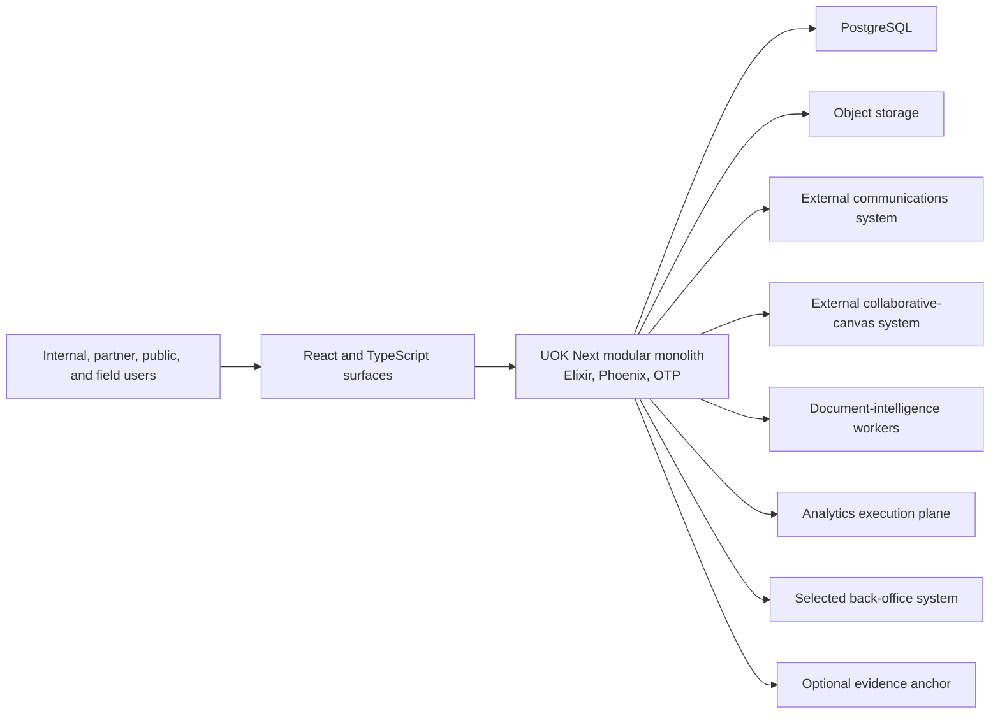

# UOK Next Architecture

**Status:** Accepted target architecture; Gate 1 and Gate 2 qualified, Gate 3 active

## 1. Architecture objective

UOK Next is a product-neutral operating kernel with installable business
modules and deliberately isolated specialist runtimes. It starts as a modular
monolith because the early business domains share transactions, identity,
policy, audit, deployment cadence, and a small engineering organization.

Service extraction requires evidence of independent scaling, security,
availability, data residency, vendor, or runtime pressure and a new ADR.

## 2. System context

## 3. Runtime containers

### UOK web/application release

Owns HTTP APIs, authenticated sessions, policy enforcement, transactional
commands, module composition, read models, human tasks, evidence metadata,
outbox publication, and the initial operational UI delivery boundary.

The React/TypeScript workspace compiles content-hashed assets into this same
release. `web/src/shell` is presentation-only and module-neutral; future module
UI belongs under `web/src/modules/<module-id>`. Browser code may request
server-owned commands and queries but never becomes authoritative for tenant,
authorization, approval, audit, evidence, or business transitions. The delivery
toolchain and deferrals are governed by ADR-0008.

The first Gate 3 identity surface is restricted to local qualification. A
high-entropy clone-local access code is constant-time checked server-side and
exchanged for a short-lived signed token containing a fixed tenant, actor, and
permission set. The browser cannot submit these claims. Production does not
configure this adapter and remains blocked on a standards-based identity
selection, session/revocation design, and trusted ingress. ADR-0014 governs the
bounded exception.

### PostgreSQL

The transactional system of record for kernel and in-process business modules.
Every table is owned by one module. Cross-module reads use public query
contracts or projections; cross-module writes use commands. PostgreSQL 19 is
the governed target. Cluster identity, roles, connections, migrations, tenant
integrity, HA/fencing, WAL/PITR, observability, maintenance, capacity, upgrade,
and retirement requirements are defined in
[`DATABASE_ARCHITECTURE.md`](DATABASE_ARCHITECTURE.md) and ADR-0007.

### Object storage

Stores business documents and evidence objects. PostgreSQL stores metadata,
hashes, policy, retention, review state, and object references. Upload,
download, promotion, redaction, quarantine, and deletion are explicit audited
commands. The Gate 1 byte-storage boundary is a provider-neutral S3 port;
SeaweedFS is only the local/CI qualifier and does not become a production
selection or policy authority. ADR-0009 governs this boundary.
Candidate bytes are capped at 8 MiB, S3 control responses at 64 KiB, writes use
create-only semantics, and read-back verifies exact length plus SHA-256 before
any future command may promote an object.

Gate 3 preflights the tenant-owned subject and expected version before reading
or persisting upload bytes, then persists a tenant- and subject-bound evidence
record before byte storage. It verifies the immutable object and finalizes
metadata through a second idempotent command. A retry can recover an already
stored exact object; it cannot overwrite or delete it. Only verified metadata
bound to the exact party can open the onboarding review task.

The second Gate 3 vertical reuses the same evidence lifecycle for a sourcing
lane. `master.products` and `master.locations` own active reference records;
`trade.sourcing` owns only the lane and resolves approved parties, products,
and locations through public module queries. Composite tenant foreign keys
reinforce the references, while evidence and the exact human task remain
separately owned platform records. ADR-0015 governs this boundary.

The third Gate 3 vertical extends `trade.sourcing` through requisition, RFQ,
attributable supplier quote, deterministic comparison, and exact human review.
Every handoff binds the source record version. Quote source bytes use the same
verified evidence boundary; the comparison stores a versioned snapshot ordered
by same-currency total price, delivery days, and stable identifier. Comparison
approval records a decision only and cannot create a purchase commitment.
ADR-0019 governs this boundary.

The fourth Gate 3 vertical gives `trade.contracts` authority over an internal,
non-binding purchase-commitment proposal. It accepts only one exact approved
comparison reference and derives every commercial term and evidence reference
through the public sourcing contract. Creation, evidence submission, and the
exact human decision each revalidate current source state. Approval explicitly
creates no contract, order, supplier communication, payment instruction, or
inventory movement. The single-workspace handoff removes term re-entry without
weakening source lineage, concurrency, tenant isolation, or approval authority.
ADR-0020 governs this boundary.

### Durable work layer

PostgreSQL-backed outbox and jobs provide retries, schedules, external side
effects, integration receipts, and dead-letter review. Business transactions
never rely on an uncommitted in-memory message.

The Gate 2 connector-receipt primitive records each outbound attempt before a
transport can act. Tenant, connector role, operation, delivery key, request
digest, subject identity/version, attempt lineage, and deadline are immutable.
Reconciliation stores only bounded outcome metadata and digests, never raw
remote content. A retry must descend from an exact retryable or timed-out
attempt; server time, named permissions, optimistic concurrency, and forced
row-level security fail closed. This is evidence for side-effect delivery, not
an external-record replica or a live connector implementation. ADR-0012
governs the primitive.

### Governed agents

The Gate 2 agent primitive accepts only bounded advisory plans. A plan binds a
stable runbook key/version to one tenant and governed subject version, stores a
server-derived digest over an acyclic graph of allowlisted non-executing step
kinds, and atomically opens an exact human review task. Approval or hold records
review evidence but always returns and emits `execution_authorized: false`.
Plan input cannot name models, tools, endpoints, arguments, or commands, and no
agent path invokes a connector, scheduler, model, tool, or business command.
Runbook definitions, model/tool execution, scheduling, budgets, and command
authorization require later explicit verticals and decisions. ADR-0013 governs
this boundary.

AI compatibility means deterministic governance of probabilistic work, not an
intelligent kernel. Prompts, retrieved content, model output, persistent
context, and tool responses remain untrusted. Model and document-intelligence
execution belongs in bounded specialist workers behind typed ports. A
server-owned runbook constrains schemas, evidence, data classification, tools,
proposed commands, delegated identity, approval policy, budgets, retries,
recursion, recovery, and evaluation thresholds. Every proposed mutation is
reauthorized as a current typed business command; no plan, memory, model, or
tool can issue permissions or bypass exact human review. ADR-0017 governs this
target and does not declare executable agents implemented.

### Specialist runtimes

- The external communications system owns messages, conversation membership,
  attachments, calls, presence, notifications, retention, and communication
  audit.
- The external collaborative-canvas system owns canvas operations,
  convergence, snapshots, and offline merge.
- Document-intelligence workers own bounded extraction, classification, and
  model execution; they do not own business decisions.
- The analytics execution plane owns high-throughput analytical execution over
  governed exports and projections, not transactional records.
- A selected back-office system owns only explicitly selected record types.
- An evidence-anchor adapter owns submission and confirmation receipts for
  evidence roots only.

## 4. Kernel responsibilities

The kernel may provide primitives for:

- tenant, organization, actor, session, service identity, and correlation;
- module catalog, dependency validation, versioning, lifecycle, and tenant
  enablement;
- policy decisions and capability checks;
- named command dispatch, validation, idempotency, optimistic concurrency, and
  execution receipts;
- domain-event recording and transactional outbox publication;
- human tasks, approvals, escalation, and workflow-instance coordination;
- evidence metadata, immutable audit events, hashing, and verification;
- integration registration, credentials references, health, and receipts;
- agent runbooks, bounded plan DAGs, approval policy, and evidence;
- observability, health, release identity, recovery, and operational controls.

The kernel must not contain commodity, country, shipment, quality, customs,
accounting, communication-content, or canvas-specific rules.

## 5. Module contract

Each module declares:

- stable identifier and version;
- owned record types and database namespace;
- public commands, queries, events, and permissions;
- role grants and policy requirements;
- migrations and rollback constraints;
- API and UI surfaces;
- evidence providers and candidate/runtime verifiers;
- dependencies and external integration contracts;
- data classification, retention, and operational objectives.

Unknown dependencies, duplicate record ownership, undeclared permissions, and
cross-module private imports fail architecture verification.

The backend kernel is already module-neutral, but current Gate 3 composition is
static. `platform.modules` will own reviewed module manifests, compatibility,
tenant enablement, surface registration, and verification receipts. Compiled
module entry points remain in the application composition root; the kernel and
shared shell consume validated descriptors rather than business-module names.
Source-to-catalog dependency checks, module-owned migration metadata,
kernel-only boot, and disabled-module boot are required before installability
is claimed. ADR-0018 governs the transition.

## 6. Action and workflow model

- Short, single-database operations execute transactionally.
- Every mutating operation is a named business command rather than generic
  unrestricted CRUD.
- Multi-record work within the monolith uses explicit application services and
  database transactions.
- A consequential human decision completes an exact tenant-, subject-, and
  subject-version-bound task in the same command transaction as business state,
  receipts, audit evidence, and outbox events.
- A deterministic comparison closes mutable input before creating its snapshot;
  recommendations remain reproducible and cannot be supplied by the UI, a
  model, or an integration.
- Long-running or external work uses durable jobs, resumable workflow state,
  idempotent steps, receipts, timeouts, and compensation where possible.
- A playbook coordinates module-owned commands and human tasks. It never owns
  shadow copies of participating business records.

## 7. Data and analytics

- PostgreSQL serves operational transactions and initial read models.
- Operational BI begins with versioned metric definitions, projections, and
  materialized views.
- Transactional outbox/CDC may later feed Parquet in object storage.
- A separate analytical execution plane is a candidate only after measured
  workload shows PostgreSQL read models are insufficient.
- Every metric must declare grain, dimensions, filters, currency/time rules,
  owner, freshness, lineage, and reconciliation tests.

## 8. Security and authority

- Authentication is centralized through standards-based OIDC/session
  integration; authorization remains server-side and command-specific.
- Tenant scope is mandatory at database and application boundaries.
- Secrets are referenced through managed configuration and never stored in
  source or business records.
- High-impact actions require deterministic policy and human approval.
- External services reauthorize access within their own ownership boundary.
- Product-facing code, APIs, events, catalogs, diagrams, and documentation use
  role-based external-system identities. Exact implementation names are
  confined to the technical evidence contexts governed by ADR-0010.
- Audit evidence is append-only and privacy-aware; hash integrity does not
  replace access control, retention, or lawful deletion policy.

## 9. Deployment evolution

Start with one application release, PostgreSQL, object storage, and separate
specialist runtimes only where already justified. The application may run web
and worker roles from the same release. Clustering, service extraction,
distributed streaming, and analytical storage are evidence-triggered
evolutions, not initial assumptions.

The supported local qualifier exposes the read-only shell over loopback HTTP
only when the explicit local deployment profile, local host, private container
binding, isolated database host, and isolated object-store transport all match.
Every other host or deployment profile remains subject to the mandatory HTTPS
redirect. Production checks prove that spoofed hosts and forwarded protocol
headers cannot activate the local exception.

## 10. Quality attributes

Priority order:

1. authority, tenant isolation, and correctness;
2. evidence, auditability, and recoverability;
3. understandable module ownership and change safety;
4. field usability and operational continuity;
5. availability and real-time responsiveness;
6. throughput and analytical performance;
7. extensibility without uncontrolled runtime plugins.
