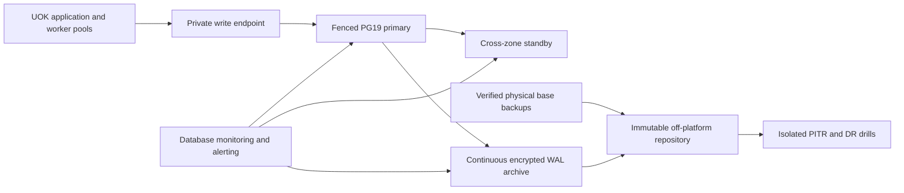

# PostgreSQL 19 data-platform architecture

**Status:** Accepted target baseline; PG19 Beta 2 compatibility qualification in progress

**Authority:** ADR-0007 and `config/database_policy.json`

## 1. Outcome

PostgreSQL is the transactional data platform for the UOK Next kernel and its
in-process business modules. It is not merely a container, a collection of
tables, or an Ecto adapter. Its supported lifecycle includes cluster creation,
identity and access, schema evolution, integrity, connections, availability,
backup and recovery, monitoring, maintenance, capacity, upgrades, retention,
and retirement.

PostgreSQL 19 is the target major version. PG19 Beta 2 is used only to qualify
application, driver, migration, and operating contracts before GA. Production
must use a supported PG19 GA minor release and must not accept `alpha`, `beta`,
`rc`, or `devel` server identities.

## 2. Quality objectives and truth boundary

The provisional production objectives are 99.9% monthly API availability, an
RPO of 15 minutes, and an RTO of 60 minutes. These remain hypotheses until a
selected platform produces failover and restore receipts under representative
load. A healthy process, a replica, or a successful backup command is not proof
of recoverability.

Production claims require evidence for:

- the exact PG19 GA minor version and immutable image or managed-service build;
- topology, zone failure, fencing, client reconnection, and failback;
- continuous WAL archival and an isolated point-in-time restore;
- encrypted off-platform retention and deletion controls;
- connection, workload, storage, WAL, vacuum, and failover capacity;
- alert delivery and an owned response runbook;
- minor and major upgrade rehearsal, including collation and extensions.

## 3. Cluster identity

Every new cluster and database uses:

| Invariant | Required value | Reason |
|---|---|---|
| Major version | 19 | One compatibility and operating target |
| Encoding | UTF8 | Complete Unicode storage contract |
| Locale provider | `builtin` | Avoid host-libc ordering drift |
| Built-in locale | `PG_UNICODE_FAST` | Stable Unicode code-point collation and full case mapping |
| Time zone | UTC | One storage and operational clock |
| Data checksums | on | Detect silent data-page corruption |
| Password encryption | SCRAM-SHA-256 | Reject new MD5 password material |
| Durability | `fsync`, `full_page_writes`, `synchronous_commit` on | No performance override may weaken committed-data durability |

Natural-language ordering is a query or column concern. A module that needs a
language-specific order must declare an explicit deterministic ICU collation,
tests, index impact, and upgrade procedure. Collation version mismatches block
promotion until dependent objects are rebuilt and the version is refreshed.

Cluster bootstrap must revoke broad `PUBLIC` creation, database connection,
table, sequence, and routine privileges before application objects are added.
Only reviewed extensions in the policy allowlist may be installed. The initial
required extension is `pg_stat_statements`; vector, geospatial, audit, and
scheduler extensions require their own ownership, upgrade, and recovery review.

## 4. Database, schema, and ownership boundaries

The modular monolith uses one PostgreSQL database and one ordered migration
history. Tables are module-prefixed and owned by exactly one module. The
initial application schema remains `public`, with `CREATE` revoked from
`PUBLIC`; adding schemas does not itself create a security boundary.

Cross-module writes use named commands. Cross-module reads use public query
contracts or owned projections. Foreign keys may cross module tables only when
the owning contracts and deletion semantics are explicit. No module receives
raw ownership of another module's tables.

Production role topology:

| Role | Authority |
|---|---|
| `uok_owner` | `NOLOGIN`; owns application objects only |
| `uok_migrator` | Runs one reviewed migration job and can assume only the owner role |
| `uok_app` | Exact transactional grants; `NOINHERIT`, `NOBYPASSRLS`, no ownership or DDL |
| `uok_outbox` | Exact claim/update grants for delivery; no business-command authority |
| `uok_monitor` | Approved statistics views or `pg_monitor`; no business-table access |
| `uok_backup` | Provider/tool-specific physical backup and WAL privileges only |
| `uok_replication` | `REPLICATION` only from approved private network identities |
| `uok_break_glass` | Disabled or vaulted by default; time-bound, approved, and audited use |

The local qualifier may use a container bootstrap superuser, but application
replicas never do. Production secrets come from a managed secret store, rotate
without image rebuilds, and are never logged, placed in URLs with query-owned
options, or committed.

## 5. Tenant and relational integrity

Every tenant-owned row has a non-null `tenant_id`. Tenant-scoped uniqueness and
indexes start with `tenant_id` unless a measured global access path justifies
otherwise. All tenant tables enable and force RLS, and runtime transactions set
the validated tenant with transaction-local state.

RLS controls row visibility; it does not replace constraints. A relationship
between tenant tables must reference a candidate key containing both
`tenant_id` and the record identifier. This prevents a guessed identifier from
linking a child in one tenant to a parent in another even when a privileged
maintenance path bypasses RLS.

Global tables, shared reference data, tenant tables, and operator-only tables
must be declared as such. Background workers either remain tenant-scoped or
use a separate narrowly granted role with an explicit cross-tenant algorithm.

Data rules:

- identifiers are UUIDs generated by trusted application code;
- timestamps use microsecond UTC types; business-local dates remain dates;
- currency and quantity use bounded exact numeric types, never floats;
- status values use reviewed constraints and forward-compatible readers;
- JSONB is for bounded evolving metadata, not undeclared business structure;
- audit and outbox payload classifications, retention, redaction, and size
  limits are part of their owning contract;
- object bytes remain in object storage; PostgreSQL stores governed metadata,
  hashes, references, and state.

## 6. Connections and transaction behavior

Applications connect only over private routes. Production TLS verifies the
server certificate chain and hostname against an explicitly mounted CA file.
`hostssl` and SCRAM-SHA-256 are minimum server-side controls; public database
ingress is prohibited.

The initial local budget is 50 server connections: 5 reserved for approved
operators, 3 reserved for superusers, 10 for two application pools, a runtime
role ceiling of 20, and the balance for migration, monitoring, backup, workers,
and failure headroom. Production recalculates the budget from maximum replica
count, every process role, rolling deployment overlap, failover overlap,
maintenance, and emergency access. Increasing `max_connections` without a
memory and saturation model is prohibited.

Writes use a primary-targeting connection. Read replicas are not enabled until
each query contract declares staleness, read-after-write, and failover
semantics. Operational BI must use governed projections or replicas and may
not exhaust OLTP resources.

PgBouncer is an evidence-triggered option, not an initial dependency. If
adopted, application transaction pooling must prove prepared-query and
transaction-local tenant behavior. The migrator bypasses PgBouncer because
session advisory locks and non-transactional DDL are not compatible with all
pooling modes.

Application sessions enforce bounded statement, lock, idle-transaction,
checkout, and queue timeouts. Long transactions, idle-in-transaction sessions,
and unbounded retries are defects because they retain locks, snapshots, and
dead tuples.

## 7. Migration discipline

One migration job runs before new replicas become ready. It connects directly
as `uok_migrator`; application replicas never run migrations on startup. The
release entrypoint must query the connected server and pass the same major and
prerelease compatibility policy as readiness before invoking Ecto Migrator.

Every production migration is classified before approval:

- metadata-only or short transactional DDL;
- online index work using `CREATE INDEX CONCURRENTLY` outside a DDL transaction;
- expand/contract change spanning at least two compatible releases;
- constraint addition using `NOT VALID`, backfill, and later validation;
- rewrite/backfill requiring rate limits, progress, pause, and resume;
- destructive or irreversible work requiring retention, backup, restore, and
  explicit rollback evidence.

All migrations have bounded lock acquisition. Large table rewrites, implicit
casts, default expressions, cascading deletes, and index builds require an
execution-plan review against production-like row counts and WAL/storage
headroom. Rollback normally means deploying compatible forward code; database
`down` functions are not assumed safe after new writes.

Schema drift is checked from migration history and catalogs. Extension, role,
default-privilege, RLS, trigger, constraint, index, and collation drift are
part of the same review—not external DBA trivia.

## 8. Availability, failover, and disaster recovery

The production minimum is a fenced write primary with a same-region standby in
another failure domain plus independent WAL/archive storage. The platform must
prevent two writable primaries. Automatic failover needs a quorum or provider
control plane, health criteria that distinguish network partitions from
database failure, a single promotion authority, DNS/proxy convergence, and a
tested reintegration path for the old primary.

Synchronous replication may reduce same-region data loss but increases commit
latency and can reduce availability. Its mode is selected only after the
business assigns loss tolerance and latency budgets. Cross-region replication
is normally asynchronous and does not replace archived WAL.

Backups combine physical base backups with continuous WAL archival so recovery
can stop at a chosen time. `pg_dump` remains useful for logical portability and
selected recovery, but it is not the PITR system. A managed equivalent or
pgBackRest must provide:

- encryption in transit and at rest with separately controlled keys;
- immutable/object-locked copies outside the database failure boundary;
- documented full/differential/incremental and WAL retention dependencies;
- backup manifests, integrity verification, archive-lag alerts, and capacity;
- configuration and role/global-object backup in addition to database files;
- isolated monthly restore drills and quarterly RPO/RTO exercises;
- application reconciliation, integrity queries, RLS checks, and release
  identity after restore;
- two-person approval and evidence for expiry or destruction.

Suggested initial retention for platform sizing is 14 daily recovery points,
8 weekly recovery points, and 13 monthly recovery points, subject to legal,
privacy, contract, cost, and tenant-deletion requirements. This is not a final
records-retention policy.

## 9. Observability and maintenance

The platform exports and alerts on:

- availability, connection use/rejections, reserved headroom, transaction rate,
  latency, errors, deadlocks, blocked locks, and long/idle transactions;
- WAL generation, archive age/failures, replication byte/time lag, slot
  retention, timeline, replay, and failover state;
- checkpoints, background writer, I/O latency, temp files, cache behavior,
  storage/inode growth, and checksum failures;
- table/index scans, slow and high-total-time normalized queries, plan changes,
  unused/duplicate indexes, and statistics age;
- dead tuples, vacuum/analyze recency, autovacuum cancellations, bloat,
  `relfrozenxid`, multixact age, and wraparound headroom;
- backup age, restore-test age, key rotation, certificate expiry, minor-version
  drift, extension drift, and collation-version mismatch.

`pg_stat_statements` stores normalized statements, but query text, logs, plans,
and parameters can still reveal sensitive structure or values. Access is
restricted to the monitoring path, parameter logging is disabled by default,
and telemetry retention follows its data classification.

Autovacuum stays enabled. Per-table thresholds are tuned from churn and table
size, especially for receipts, outbox, audit, and high-update business state.
The goal is regular vacuum/analyze work that avoids `VACUUM FULL`, planner
staleness, bloat, and wraparound. Partitioning and archival are introduced only
from measured retention, pruning, maintenance, or deletion needs.

## 10. Capacity and performance

Before production and every material scale increase, test representative row
counts, tenant skew, concurrency, payload sizes, transaction mix, failover,
backup, restore, vacuum, and migration load. Record p50/p95/p99 command latency,
lock wait, throughput, CPU, memory, IOPS, WAL rate, storage growth, replica lag,
and recovery time.

Index changes begin with actual query plans and statistics. More indexes can
slow writes, increase WAL and storage, and extend vacuum/recovery. Caches,
partitioning, replicas, CDC, and a Rust analytical plane require measured
pressure and reconciliation contracts; they are not substitutes for correct
queries and bounded transactions.

## 11. Upgrade and change lifecycle

The PG19 compatibility lane runs the complete migration and application suite
against each beta, release candidate, and GA image digest. Production promotion
requires GA, a current minor, supported Postgrex/Ecto versions, extension
compatibility, dump/restore or `pg_upgrade` rehearsal, query-plan comparison,
and rollback/fallback evidence.

Minor updates are rehearsed and applied promptly because PostgreSQL minor
releases contain bug, corruption, and security fixes. Major upgrades are new
deployments with explicit compatibility and recovery plans. OS or ICU changes
trigger collation mismatch checks and any required `REINDEX` before the catalog
version is refreshed.

## 12. Gap register

| Gap found in the initial architecture | Initial-stage treatment | Remaining production evidence |
|---|---|---|
| PostgreSQL 18.4 was a dependency, not a governed target | PG19 policy, ADR, digest-pinned compatibility lane, runtime major check | Pin and qualify PG19 GA/current minor |
| Host-dependent libc locale | Built-in `PG_UNICODE_FAST`, UTF8, UTC baseline | Confirm managed-platform support and upgrade behavior |
| TLS encryption was asserted without an explicit trust file contract | Mandatory CA file plus Postgrex peer/hostname verification | Issue/mount/rotate production CA and test expiry |
| Child receipt FKs did not bind tenant | Composite tenant candidate key and child FKs | Continue invariant checks for every new tenant relationship |
| Production roles and default privileges were unspecified | Eight-role least-authority contract and local drift proof | Materialize in selected platform/IaC and verify rotation |
| Connection count was per-process only | Cross-replica connection budget and runtime role ceiling | Load-test autoscaling, deployment overlap, workers, and failover |
| No platform bootstrap/extension allowlist | Revoked broad defaults and allowlisted `pg_stat_statements` bootstrap | Prove managed extension lifecycle and monitoring access |
| Prerelease rejection originally occurred only at readiness | Shared connected compatibility preflight runs before readiness and before Ecto Migrator | Requalify the preflight against PG19 GA/current minor |
| No zero-downtime migration contract | Expand/contract classes, one direct migrator, lock budgets | Rehearse large migration and rollback on realistic data |
| Local database was single-node with no fencing design | Explicit primary/standby/fencing contract | Select platform and prove failover/failback |
| No WAL, PITR, or restore receipt | Backup/PITR/retention/restore acceptance contract | Configure target, restore monthly, meet RPO/RTO |
| Limited database telemetry | Statistics, I/O, locks, slow-query, WAL, vacuum baseline | Connect alerts, dashboards, ownership, and privacy controls |
| No vacuum/freeze or growth plan | Maintenance and capacity contract | Establish workload-specific thresholds from production-like load |
| No data lifecycle/retention contract | Classification and provisional backup retention rules | Legal/privacy approval and tenant export/delete drills |
| BI could contend with OLTP | Explicit projection/replica/analytical-plane gates | Prove workload isolation before enabling BI scale path |

## 13. Initial and production acceptance gates

The initial PG19 work is complete only when CI and local qualification prove
the cluster baseline, migrations, application tests, role reconciliation,
tenant constraints, authenticated TLS configuration, and readiness behavior.

Production remains blocked until all of the following are attached to a
candidate release:

1. supported PG19 GA/current-minor identity and extension inventory;
2. private network and TLS certificate verification/rotation evidence;
3. materialized roles, grants, RLS, default privileges, and break-glass drill;
4. connection/capacity result including rolling deployment and failover;
5. HA promotion, fencing, reconnect, old-primary reintegration, and failback;
6. continuous WAL archival, immutable encrypted backup, and isolated PITR
   restore meeting RPO/RTO;
7. monitoring dashboards, alert delivery, runbooks, and owners;
8. representative migration, rollback, minor-upgrade, and collation checks;
9. security assessment and data-retention/privacy approval.

## 14. Primary references

- [PostgreSQL 19 beta guidance](https://www.postgresql.org/developer/beta/)
- [PostgreSQL versioning policy](https://www.postgresql.org/support/versioning/)
- [Locale providers and `PG_UNICODE_FAST`](https://www.postgresql.org/docs/19/locale.html)
- [Data checksums](https://www.postgresql.org/docs/19/checksums.html)
- [Password authentication](https://www.postgresql.org/docs/19/auth-password.html)
- [TLS server and client verification](https://www.postgresql.org/docs/19/ssl-tcp.html)
- [Row security policies](https://www.postgresql.org/docs/19/ddl-rowsecurity.html)
- [Continuous archiving and PITR](https://www.postgresql.org/docs/19/continuous-archiving.html)
- [Warm standby and streaming replication](https://www.postgresql.org/docs/19/warm-standby.html)
- [Statistics views](https://www.postgresql.org/docs/19/monitoring-stats.html)
- [`pg_stat_statements`](https://www.postgresql.org/docs/19/pgstatstatements.html)
- [Routine vacuuming](https://www.postgresql.org/docs/19/routine-vacuuming.html)
- [Ecto PostgreSQL migration locking](https://hexdocs.pm/ecto_sql/Ecto.Adapters.Postgres.html)
- [PgBouncer pooling semantics](https://www.pgbouncer.org/features.html)
- [pgBackRest backup and restore guide](https://pgbackrest.org/user-guide.html)
