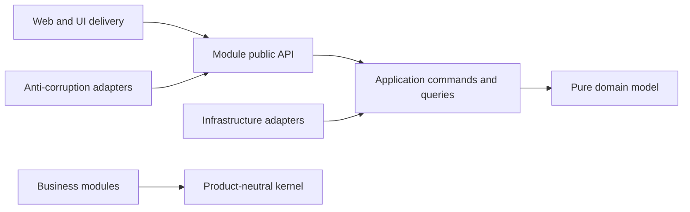

# Modular Monolith Contract

**Status:** Accepted system-design contract

## 1. Deployment and repository shape

UOK Next begins as:

- one Git repository;
- one Phoenix/Mix application rather than an umbrella of deployable apps;
- one versioned application release, optionally started in web and worker roles;
- one PostgreSQL database and migration history;
- one React/TypeScript frontend workspace;
- one transactional outbox and durable job boundary;
- specialist external runtimes only where the architecture already proves a
  distinct authority or runtime need.

This is a modular monolith, not a collection of source folders pretending to
be services and not a tightly coupled application with context names painted
on top.

## 2. Source layout

The initial Elixir layout is:

```text
lib/uok_next/
  kernel/                    product-neutral primitives
  modules/
    platform/<context>/      optional platform modules
    master/<context>/        party/product/location authority
    operations/<context>/    business work coordination
    trade/<context>/         sourcing/contracts/shipment/etc.
    intelligence/<context>/  BI and governed publishing
  integrations/              anti-corruption adapters
lib/uok_next_web/             HTTP, websocket, serialization, delivery
web/src/
  shell/                      application shell and shared presentation only
  modules/<module-id>/        module-owned UI
```

Within a business context:

```text
<context>/
  public.ex          the supported cross-module API
  domain/            entities, value objects, invariants, pure decisions
  application/       commands, queries, orchestration, ports
  infrastructure/    Ecto repositories and adapter implementations
  policies/          authorization and decision policy
  projections/       owned read models and event consumers
```

Folders are created only when they contain real code. Empty architecture
scaffolding is prohibited.

## 3. Dependency direction



Rules:

- Kernel code cannot import a business module.
- Delivery code cannot contain domain policy or write repositories directly.
- Domain code cannot depend on Phoenix, HTTP, JSON, Ecto schemas, external
  clients, Oban, or UI concerns.
- Infrastructure implements application-owned ports.
- A module may call another module only through its `public.ex` contract and a
  dependency declared in the module catalog.
- Private schemas, repositories, policies, and internal functions are not
  cross-module APIs.
- Module dependencies are acyclic.

Gate 1 will add compile/static architecture checks for these rules after the
real namespace and dependency graph exist.

## 4. Communication between modules

Use the narrowest consistency mechanism that matches the business rule:

1. **Public query:** synchronous read when the caller needs current owned state.
2. **Public command:** mutation requested from the owning module.
3. **Domain/integration event:** asynchronous projection, notification, or
   integration where eventual consistency is acceptable.
4. **Workflow:** long-running coordination of commands, events, human tasks,
   timers, evidence, and compensation.

A module never copies another module's authoritative record to make mutation
easier. It may own a clearly labeled projection with source id, source version,
freshness, and reconciliation state.

## 5. Transaction boundaries

- The owning module protects its invariants in one PostgreSQL transaction.
- Command state, audit event, domain events, and outbox entries commit together.
- Cross-module atomicity is exceptional. When a business invariant genuinely
  spans modules inside the same database, an application transaction
  coordinator invokes public module operations without accessing private
  tables. The invariant and rollback behavior require tests and an ADR if it
  becomes common.
- External systems never participate in a database transaction. Use durable
  intent, idempotent delivery, receipts, reconciliation, and compensation.
- Distributed transactions are not part of the initial design.

## 6. Database ownership and tenancy

- Tables remain in one PostgreSQL database with clear module-prefixed names and
  migration ownership. Separate PostgreSQL schemas are not the initial module
  boundary.
- Tenant-owned records carry mandatory `tenant_id`; global reference records
  are explicitly declared.
- Application tenant checks are reinforced by PostgreSQL constraints and RLS
  where the runtime spike proves the operational model.
- Shared-table attribute tenancy is the initial approach; schema-per-tenant is
  rejected until a residency, isolation, deletion, or scale requirement
  justifies its operational cost.
- Cross-module foreign keys may protect referential integrity, but ownership
  and mutation still remain with one module.

## 7. Module split test

Create or split a bounded context when most of these are independently true:

- distinct business vocabulary and invariants;
- clear record and decision authority;
- distinct permission or evidence policy;
- independent lifecycle or roadmap;
- independent operational objective or data classification;
- stable public commands/events can hide implementation;
- a responsible owner can maintain it.

Do not create a module solely because there is a menu tile, database table,
team preference, large file, background job, or possible future service.

## 8. Service extraction test

A module may become a service only when repository/runtime evidence proves at
least one material need:

- independent horizontal scaling or resource profile;
- fault/availability isolation unavailable inside the release;
- stronger security, privacy, network, or data-residency boundary;
- incompatible runtime or deployment requirement;
- external product/provider lifecycle;
- independently owned release cadence that outweighs distributed-system cost.

Extraction requires an ADR covering data migration, consistency, API/events,
identity, authorization, observability, backup/restore, degraded operation,
versioning, rollout, and rollback.

## 9. Initial module scope

The accepted module identifiers and record ownership are defined in
`config/module_catalog.json`. Initial modules are intentionally broader than
individual entities. They may gain internal subdomains without becoming new
top-level modules or services.

